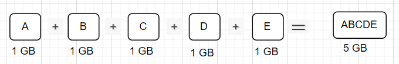

Deduplication: 
---------------
It will avoid writing the same data on the backup disk.

Application Size:
------------------
Readable data from a VM (Virtual Machine).

Full Backup:
-------------
When we configure the backup for any VM, Full backup is always going to be the Initial/First backup.

Incremental Backup:
--------------------
It will only backup the data which is modified from the last backup.

Deduplication Example:
---------------
1. Let's say we have VM with four blocks of Data each block contains 1 GB of Data
   Then, total blocks size would be 4 GB

Full Backup:
----------------
Application size : 4 GB

Data written on the backup disk: 4 GB (A+B+C+D)

Total data written on the disk: 4 GB

Deduplication Savings: 0%

Baseline Data: A+B+C+D (4GB)

2. Let's say another block of data is added into VM

Incremental Backup:
--------------------
Application size :  5 GB

Data written on the backup disk: 1 GB (E), because Incremental job is avoiding the ABCD blocks because they are already written by Full backup job.

Total data written on the disk: 5 GB

Deduplication Savings: 75%

Baseline Data: A+B+C+D+E (5GB)

